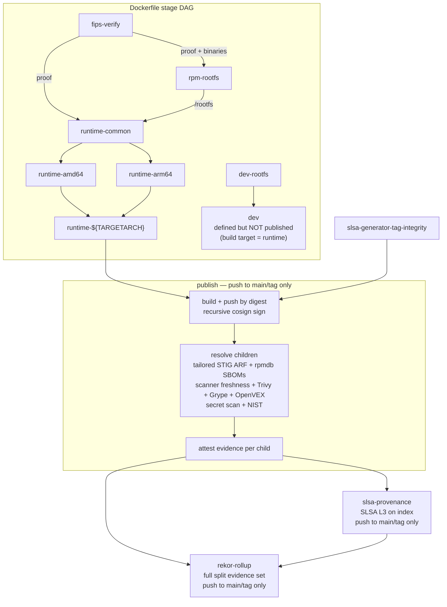

# ubi9-base-micro

[](https://scorecard.dev/viewer/?uri=github.com/NWarila/ubi9-base-micro)
[](https://github.com/NWarila/ubi9-base-micro/actions/workflows/codeql.yml)

`ubi9-base-micro` builds the root UBI 9 micro base for the NWarila base-image
family. It produces two local-test image tags from one Dockerfile:

- `base-micro`: glibc plus RHEL CA trust, no shell, no package-manager
  executable, RPM database preserved at `/var/lib/rpm`, and `USER 65532:65532`.
- `base-micro-dev`: the same UBI 9 floor with a shell and a minimal native
  build toolchain for leaf build-time stages.

## Why It Exists

The image is the smallest hardened floor in the platform base family. It keeps
the rpmdb for truthful scanners, installs all runtime RPMs from direct Red Hat
UBI CDN pins with raw `rpm -Uvh`, configures the Red Hat OpenSSL FIPS provider
in approved mode, and removes runtime shell/package-manager entry points. The
leaf image or application still owns app-specific minimization such as Java
`jdeps`/`jlink`, Python stdlib pruning, and application dependency trimming.

Rebuilds use pinned direct-CDN RPMs for both the runtime transaction and the
FIPS-verification OpenSSL closure, without consulting live repository metadata.
They fail closed if a pinned blob is unavailable. Red Hat CDN retention is not
guaranteed, so this is a bounded rebuild window rather than a claim that a commit
reproduces forever; see [TD-4](docs/TECH-DEBT.md#td-4-red-hat-ubi-direct-cdn-blob-availability).

## Verify From a Clean Machine (No Auth)

Anyone can cryptographically verify the published
`ghcr.io/nwarila/ubi9-base-micro:base-micro` image with no registry
authentication. The prerequisites are `cosign`, `crane`, `jq`, and
`slsa-verifier`.

Resolve the moving `base-micro` tag once, then anchor every child lookup to the
resolved index so a concurrent publish cannot mix index and child generations:

```sh
IMAGE="ghcr.io/nwarila/ubi9-base-micro"
TAG="base-micro"
INDEX_DIGEST="$(crane digest "${IMAGE}:${TAG}")"
INDEX_REF="${IMAGE}@${INDEX_DIGEST}"
CHILD_DIGEST="$(crane digest --platform linux/amd64 "${INDEX_REF}")"
CHILD_REF="${IMAGE}@${CHILD_DIGEST}"
PUBLISH_REF="refs/heads/main"
```

Verify the index signature:

```sh
cosign verify "${INDEX_REF}" \
  --certificate-identity "https://github.com/NWarila/ubi9-base-micro/.github/workflows/publish-image.yaml@${PUBLISH_REF}" \
  --certificate-oidc-issuer "https://token.actions.githubusercontent.com"
```

Verify the SPDX and CycloneDX attestations on the selected platform child:

```sh
cosign verify-attestation --type spdxjson "${CHILD_REF}" \
  --certificate-identity "https://github.com/NWarila/ubi9-base-micro/.github/workflows/publish-image.yaml@${PUBLISH_REF}" \
  --certificate-oidc-issuer "https://token.actions.githubusercontent.com"
```

```sh
cosign verify-attestation --type cyclonedx "${CHILD_REF}" \
  --certificate-identity "https://github.com/NWarila/ubi9-base-micro/.github/workflows/publish-image.yaml@${PUBLISH_REF}" \
  --certificate-oidc-issuer "https://token.actions.githubusercontent.com"
```

Check the verified SPDX predicate for the required glibc package:

```sh
cosign verify-attestation --type spdxjson "${CHILD_REF}" \
  --certificate-identity "https://github.com/NWarila/ubi9-base-micro/.github/workflows/publish-image.yaml@${PUBLISH_REF}" \
  --certificate-oidc-issuer "https://token.actions.githubusercontent.com" \
  | jq -r '.payload | @base64d | fromjson | .predicate.packages[].name' | grep -q glibc
```

When a `vex/*.json` file exists in the publishing commit, verify the OpenVEX
attestation on the selected platform child:

```sh
cosign verify-attestation --type openvex "${CHILD_REF}" \
  --certificate-identity "https://github.com/NWarila/ubi9-base-micro/.github/workflows/publish-image.yaml@${PUBLISH_REF}" \
  --certificate-oidc-issuer "https://token.actions.githubusercontent.com"
```

Verify the NIST SP 800-190 section 4.1 image-control predicate:

```sh
cosign verify-attestation --type https://nwarila.dev/attestations/nist-sp-800-190-image/v1 "${CHILD_REF}" \
  --certificate-identity "https://github.com/NWarila/ubi9-base-micro/.github/workflows/publish-image.yaml@${PUBLISH_REF}" \
  --certificate-oidc-issuer "https://token.actions.githubusercontent.com"
```

Verify the tailored RHEL9 STIG ARF predicate:

```sh
cosign verify-attestation --type https://nwarila.dev/attestations/stig-arf/v1 "${CHILD_REF}" \
  --certificate-identity "https://github.com/NWarila/ubi9-base-micro/.github/workflows/publish-image.yaml@${PUBLISH_REF}" \
  --certificate-oidc-issuer "https://token.actions.githubusercontent.com"
```

Finally, verify the index-bound SLSA provenance with both verifiers:

```sh
cosign verify-attestation --type slsaprovenance "${INDEX_REF}" \
  --certificate-identity "https://github.com/slsa-framework/slsa-github-generator/.github/workflows/generator_container_slsa3.yml@refs/tags/v2.1.0" \
  --certificate-oidc-issuer "https://token.actions.githubusercontent.com"
```

```sh
slsa-verifier verify-image "${INDEX_REF}" \
  --source-uri github.com/NWarila/ubi9-base-micro \
  --builder-id "https://github.com/slsa-framework/slsa-github-generator/.github/workflows/generator_container_slsa3.yml@refs/tags/v2.1.0"
```

[`docs/reference/verify.md`](docs/reference/verify.md) is the authoritative full
contract, including rationale and edge cases. See also the
[`docs/how-to/verify-a-published-image.md`](docs/how-to/verify-a-published-image.md)
task flow. `gh attestation verify` is not part of this repository's
published-image contract.

## Supply Chain Pipeline



Pull requests exercise the tag-integrity job but do not publish, attest, or run
the Rekor roll-up.

## Comparison at a Glance

| Dimension | `ubi9-base-micro` | Stock `ubi9/ubi-micro` | Chainguard | Canonical rocks |
| --- | --- | --- | --- | --- |
| Package inventory | Retained RPM rpmdb, rpmdb-derived SPDX and CycloneDX SBOMs, and a no-phantom-package guard. | Retained RPM rpmdb, matching the same UBI base ecosystem. | APK/Wolfi ecosystem with signed SBOMs and no RPM rpmdb. | dpkg/Chisel ecosystem with no RPM rpmdb; Chisel's `manifest.wall` supplies package, slice, and file metadata to scanners. |
| Signing, SBOM, provenance / SLSA | Cosign keyless signature, per-child SPDX and CycloneDX SBOMs, and index-bound SLSA L3 provenance. | Artifact-level signing, SBOM, and provenance evidence depends on the selected digest and publication channel. | Signed images and SBOMs with SLSA 3 provenance. | The OCI factory produces SBOMs and provenance; exact signing and SLSA mechanisms vary by rock and channel. |
| STIG evidence | Tailored RHEL9 STIG ARF, evaluated fail-closed and signed per platform child. | RHEL9 STIG content is available; artifact-specific ARF evidence depends on the selected digest and channel. | GPOS-SRG STIG profile and STIG-hardened images. | Ubuntu DISA-STIG material is available; per-rock evidence varies. |
| CMVP FIPS | RHEL OpenSSL provider #4857 in approved mode on amd64; arm64 runs the same provider and self-tests but is not a validated operational environment. | RHEL FIPS modules are available under Red Hat certificates; exact provider and configuration evidence is artifact-specific. | Approved-only FIPS images use other validated modules, including OpenSSL #4282. | Ubuntu FIPS modules and containers operate under Canonical certificates and their documented runtime conditions. |
| Byte reproducibility | Fail-closed two-build identity for both architectures, with exported-rootfs, contract-digest, and rpmdb assertions. | Artifact-level reproducibility evidence depends on the selected digest and publication pipeline. | Bit-for-bit reproduction from signed apko configuration. | Reproducibility varies by rock and build pipeline. |
| Footprint | 22.74 MiB (23,840,723 B) for the amd64 regular-file rootfs, gated at 25 MiB. | 21.93 MiB (22,995,384 B) by the same method, about 0.81 MiB smaller. | Varies by image and package set. | Varies by rock and slice selection. |

Signing, SBOMs, SLSA, STIG hardening, FIPS, and reproducibility exist across
these families; this table highlights this repository's specific, verifiable
mechanisms: RPM rpmdb evidence, the #4857 approved-mode provider, a tailored
RHEL9 STIG ARF attestation, and a fail-closed byte-for-byte digest gate.

## Image Family

Only `ubi9-base-micro` exists in this repository today; the language variants
below are planned and must not be read as published artifacts from this repo.

| Image | Status | Base relationship | Runtime scope |
| --- | --- | --- | --- |
| `base-micro` | Current repository | Root image | glibc, CA trust, rpmdb, OpenSSL #4857 provider |
| `base-python` | Planned | `FROM base-micro@sha256:<digest>` | CPython runtime on the micro floor |
| `base-node` | Planned | `FROM base-micro@sha256:<digest>` | Node.js runtime on the micro floor |
| `base-java` | Planned | `FROM base-micro@sha256:<digest>` | OpenJDK runtime on the micro floor |

The evidence contract for each image in the family is the same: cosign keyless
signature, SLSA L3 provenance, rpmdb-derived SPDX and CycloneDX SBOMs, Trivy and
Grype fixable-CVE gates, OpenVEX default-deny coverage for unfixed HIGH/CRITICAL
findings, NIST SP 800-190 section 4.1 image evidence, tailored RHEL9 STIG ARF,
and byte-for-byte reproducibility. Published signatures and attestations are
Rekor-logged. `base-micro` implements that contract here; planned variants must
carry the same evidence set in their own repositories before publication.

Responsibility boundary: the base family owns a standard hardened floor through
RPM hygiene (`install_weak_deps=0`, `--nodocs`, locale/man stripping, shell
removal, discarded builders) with the rpmdb preserved for truthful scanning. The
leaf/user owns app-specific minimization such as Java `jdeps`/`jlink`, Python
stdlib pruning, and application dependency trimming.

## Quickstart

Build both local tags:

```sh
make build
```

Run the runtime hardening gate against `base-micro`:

```sh
make test
```

Run the repository contract verifier:

```sh
python tools/verify.py
```

The repository namespace for publish work is:

```text
ghcr.io/nwarila/ubi9-base-micro
```

## Security and Compliance Posture

The runtime uses the Red Hat Enterprise Linux 9 OpenSSL FIPS Provider in
approved mode through `/etc/pki/tls/openssl-fips.cnf` and
`OPENSSL_CONF`/`OPENSSL_MODULES`. Both amd64 and arm64 hold
`openssl-fips-provider-so-3.0.7-8.el9` with `fips.so` version
`3.0.7-395c1a240fbfffd8`; the provider RPMs are fetched from Red Hat UBI CDN
direct URLs, verified with Red Hat RPM signatures and pinned SHA-256 values, and
installed locally to preserve rpm ownership. The amd64 image is the CMVP #4857
validated approved-mode configuration. The arm64 image ships the same module and
passes approved-mode self-tests, but it is explicitly not a CMVP-validated
configuration on that architecture because #4857 lists no arm64 OE. These are
module-scoped and approved-mode-scoped statements, not host, OS, container, or
application FIPS validation claims. The platform host remains non-FIPS. See
[`docs/compliance/fips.md`](docs/compliance/fips.md) and
[`docs/explanation/fips-mechanism.md`](docs/explanation/fips-mechanism.md).

The authoritative SBOM evidence is Syft rpmdb-derived SPDX and CycloneDX,
attested per published platform child digest. BuildKit SBOM output is disabled
so the published SPDX evidence has a single source. Vulnerability scanners,
OpenVEX default-deny, NIST SP 800-190 section 4.1 image evidence, and the
tailored RHEL9 STIG ARF gate are gated in CI; publish attaches the STIG ARF
summary predicate per platform digest. See
[`docs/compliance/stig.md`](docs/compliance/stig.md),
[`docs/compliance/nist-800-190.md`](docs/compliance/nist-800-190.md), and
[`docs/compliance/vex.md`](docs/compliance/vex.md).

Runtime footprint is gated by `tools/assert-footprint.py` using
exported-rootfs-regular-file-bytes. The current amd64 runtime measures
23,840,723 bytes / 22.7363 MiB against the 25 MiB H2 gate; local OCI compressed
layer sum is 12,095,601 bytes / 11.5353 MiB. See
[`docs/explanation/footprint.md`](docs/explanation/footprint.md).

Repository-specific decisions are recorded under `docs/decision-records/repo/`.
They cover the byte-for-byte reproducibility gate, FIPS scope, SLSA generator
identity model, runtime strip posture, RPM refresh loop, scanner/VEX policy,
STIG and NIST evidence, CI runner determinism, direct-CDN runtime RPM sourcing,
and base-family topology.

## Documentation

The docs follow the org-standard Diataxis layout:

- [Tutorials](docs/tutorials/) for learning walkthroughs.
- [How-to guides](docs/how-to/) for task procedures.
- [Reference](docs/reference/) for contracts and gate inventories.
- [Explanation](docs/explanation/) for design rationale.
- [Compliance](docs/compliance/) for scoped evidence notes.
- [Decision records](docs/decision-records/) for repository ADRs.

Start with [`docs/README.md`](docs/README.md) for the full index.

## License

This repository is licensed under the terms in [LICENSE](LICENSE).
